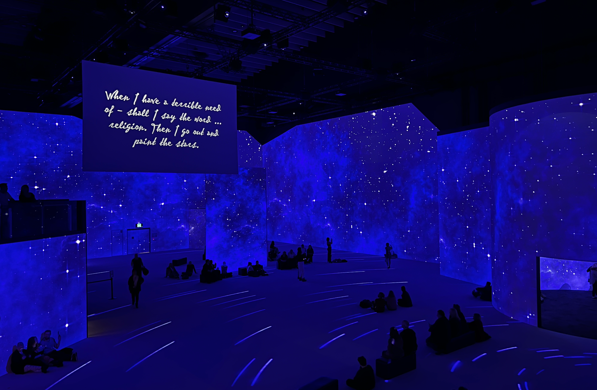

# qhua6277_9103_tut2

This is a repo that I will use to learn github.

# **Quiz 8**
## *Part 1*
I was inspired by the electronic exhibition of Van Gogh's paintings that I saw in Melbourne last year (photo1, photo2 and photo3). The painting can be expressed through the colour lines as the original is a smooth colourful line, and the animation can be added to make the colour lines keep flowing. I also learnt from the information that The Scream is the harbour and the world in Munch's eyes when he was not in a good state of mind, and the twisted lines could better express this feeling.

## *Part 2*
Mainly hope to use several functions, the most important one is animation (screenshot1), through this to make the line for regular movement. In addition, due to there are many lines, so the use of array can be considered.Also, refer to the work of blogger Iris, she created the animation of smooth lines appearing through the code, the effect is as in screenshot2 (the left is the initial, the right is the end), part of the code as in screenshot3.

